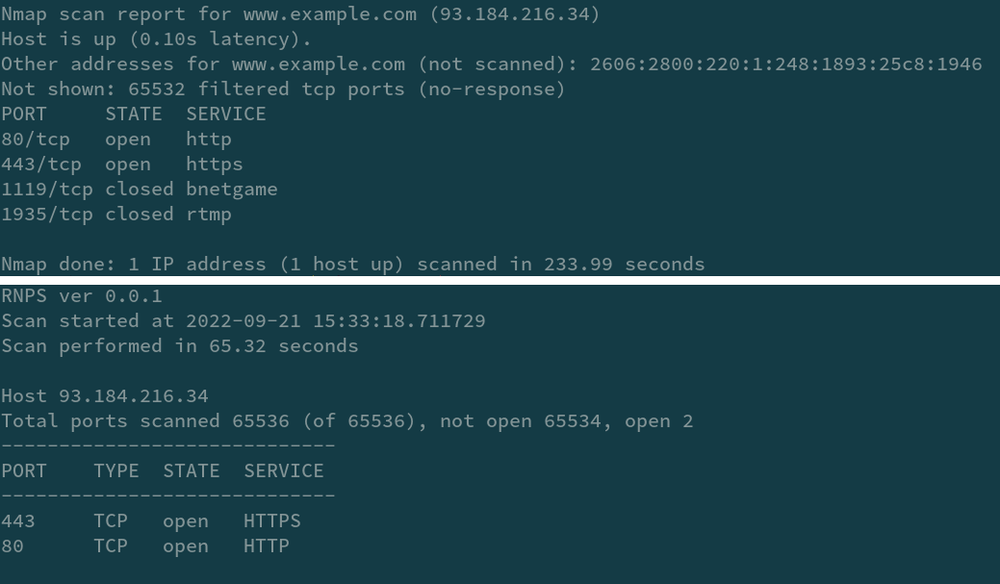

<!-- Improved compatibility of back to top link: See: https://github.com/othneildrew/Best-README-Template/pull/73 -->
<a name="readme-top"></a>

<!-- PROJECT LOGO -->
<br />
<div align="center">
  <a href="images/logo.png">
    
  </a>

  <h3 align="center">RNPS</h3>

  <p align="center">
    Rapid Network Port Scan
    <br />
  </p>
</div>

<!-- TABLE OF CONTENTS -->
<details>
  <summary>Table of Contents</summary>
  <ol>
    <li><a href="#about-the-project">About The Project</a></li>
    <li><a href="#disclaimer">Disclaimer</a></li>
    <li><a href="#getting-started">Getting Started</a></li>
    <li><a href="#usage">Usage</a></li>
    <li><a href="#errors">Errors</a></li>
    <li><a href="#comparison">Comparison</a></li>
    <li><a href="#contributing">Contributing</a></li>
    <li><a href="#license">License</a></li>
  </ol>
</details>

<!-- ABOUT THE PROJECT -->
## About The Project

Yet another port scanner...but

There are many software that perform a scan of network ports, and probably they are better than this about informations, but they are tricky slow.

I was planning to make a port scanner that was quick to type, no frills and that could scan all 65535 ports in no time (maybe), and so I started writing this software in Python ... wait, Python?

Yes I know, I wasn't convinced too, but after some thread pool tests, I was able to <b>scan all 65535 ports of a host in about 10 seconds !</b> Not bad for the little snake, right? (test performed on Window 10 AMD Ryzen 5 3600)

Unfortunately, you are not always lucky, on some operating systems a limit is set (per system and / or per user) on the processes open at the same time.
On UNIX / Linux systems this limit may be set to 1024, so performing a scan of all ports may fail, and results in a partial scan.

If this happens it is possible to limit the maximum number of threads to execute, but this results in a slowdown.

<p align="right">(<a href="#readme-top">back to top</a>)</p>

## Disclaimer

The use of this software must be considered for internal purposes of your own network or a network of which you are an administrator. The effectiveness or truthfulness of the information reported is not guaranteed.

<p align="right">(<a href="#readme-top">back to top</a>)</p>

<!-- GETTING STARTED -->
## Getting Started

Oh! it's very easy to use, but for everything else look the the built-in helper

### First of all

You can use rnps with your python interpreter, as well as out of the box.

  ```sh
  python rnps.py ...
  ```
But if you prefer you can create an executable with pyinstaller.

### Show the helper

  ```sh
  python rnps.py -h
  ```

### Simple scan example

  ```sh
  python rnps.py www.example.com
  ```
  
Output
  ```txt
  RNPS ver 0.0.1
  Scan started at 2022-09-21 13:34:11.507624      
  Scan performed in 0.11 seconds

  Host 93.184.216.34
  Total ports scanned 1 (of 1), not open 0, open 1
  -----------------------------
  PORT    TYPE  STATE  SERVICE
  -----------------------------
  80      TCP   open   HTTP
  ```

As you can see, rnps automatically resolves the host name to ip address,
and by default it scans port 80

<p align="right">(<a href="#readme-top">back to top</a>)</p>

## Usage

Ok, now let's see some more options.

### The host

As seen above, you can type either the host name or the ip address.

It's also possible to scan a subnet, using CIDR notation, for example:

  ```sh
  python rnps.py 192.168.1.1/24
  ```
### Define the ports to be scanned

With the -p parameter you can list the ports to be scanned.
  ```sh
  python rnps.py 192.168.1.10 -p 22 443 21
  ```

If you want to define a range of ports instead, you can use the -r parameter
  ```sh
  python rnps.py 192.168.1.10 -r 1024-4000
  ```

You can exclude ports from scanning with the -e parameter.
  ```sh
  python rnps.py 192.168.1.10 -r 1024-4000 -e 2000 2005
  ```

With the parameter -e you can indicate a list of ports or a range.
  ```sh
  python rnps.py 192.168.1.10 -r 1024-4000 -e 2000-3000
  ```

NOTE: The -p, -r parameters can be combined together
<p align="right">(<a href="#readme-top">back to top</a>)</p>

### Facilitators

There are some parameters that simplify the use of the command.

Scan all ports in the range 0-65535
  ```sh
  python rnps.py 192.168.1.10 --all
  ```

Scan all ports in the range 0-1023
  ```sh
  python rnps.py 192.168.1.10 --reserved
  ```

Scan all ports in the range 1024-49151
  ```sh
  python rnps.py 192.168.1.10 --registered
  ```

Scan all ports in the range 49152-65535
  ```sh
  python rnps.py 192.168.1.10 --free
  ```

### Output

By default the output is redirected to 'stdout', therefore the console in use.

You can save the result to a file with the -f parameter
  ```sh
  python rnps.py 192.168.1.10 -p 80 443 22 -f my_scan.txt
  ```

If you prefer, rnps converts the scan result to JSON format, with the --json parameter
  ```sh
  python rnps.py 192.168.1.10 -p 80 443 22 --json
  ```

You can save the result in JSON format to file, combining the -f and --json parameters
  ```sh
  python rnps.py 192.168.1.10 -p 80 443 22 --json -f my_scan.json
  ```

## Errors

On some OS it may happen that errors occur during the scan.

if a message like this appears :
  ```sh
  WARNING ! The scan is incomplete !
  Errors were encountered during the execution of individual tasks.
  ```
Try reducing the number of threads running with the -t parameter
  ```sh
  python rnps.py 192.168.1.10 --all -t 1020
  ```
Unfortunately, if you run a full scan by reducing the number of threads, the scan will take longer.
<p align="right">(<a href="#readme-top">back to top</a>)</p>

## Comparison

This is a comparison with a very famous tool, run on the same machine (T430 Arch Linux)

All 65536 ports have been scanned (0-65535), the results are different (doh!) But hey, it's just the very first pre-release, and in any case the open ports are the same.

The execution times, however, are clearly different !

(To be clear, a limit of running threads has been set to 1020 on this machine)
<a href="images/comparison_nmap_t430.png">
    
  </a>

<!-- CONTRIBUTING -->
## Contributing

Contributions are what make the open source community such an amazing place to learn, inspire, and create. Any contributions you make are **greatly appreciated**.

If you have a suggestion that would make this better, please fork the repo and create a pull request. You can also simply open an issue with the tag "enhancement".
Don't forget to give the project a star! Thanks again!

1. Fork the Project
2. Create your Feature Branch (`git checkout -b feature/AmazingFeature`)
3. Commit your Changes (`git commit -m 'Add some AmazingFeature'`)
4. Push to the Branch (`git push origin feature/AmazingFeature`)
5. Open a Pull Request

<p align="right">(<a href="#readme-top">back to top</a>)</p>


<!-- LICENSE -->
## License

Distributed under the AGPLv3. See `LICENSE.txt` for more information.

<p align="right">(<a href="#readme-top">back to top</a>)</p>

